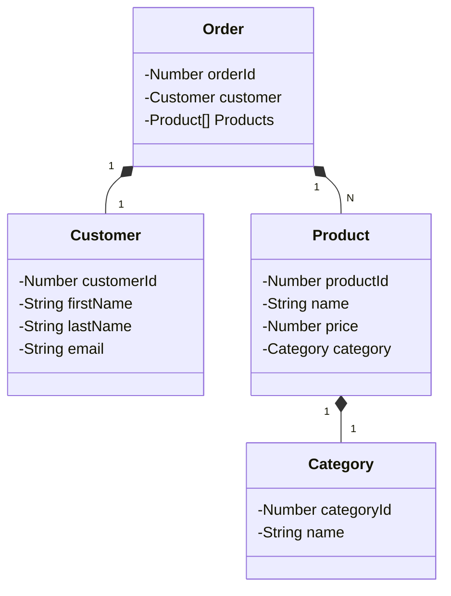

## Diagrama de Classes (Domínio da API)

```mermaid
classDiagram
  class Customer {
    -Number customerId
    -String firstName
    -String lastName
    -String email
  }

  class Product {
    -Number productId
    -String name
    -Number price
    -Category category
  }

  class Category {
    -Number categoryId
    -String name
  }

  class Order {
    -Number orderId
    -Customer customer
    -Product[] Products
  }


  Order "1" *-- "1" Customer
  Order "1" *-- "N" Product
  Product "1" *-- "1" Category

```
